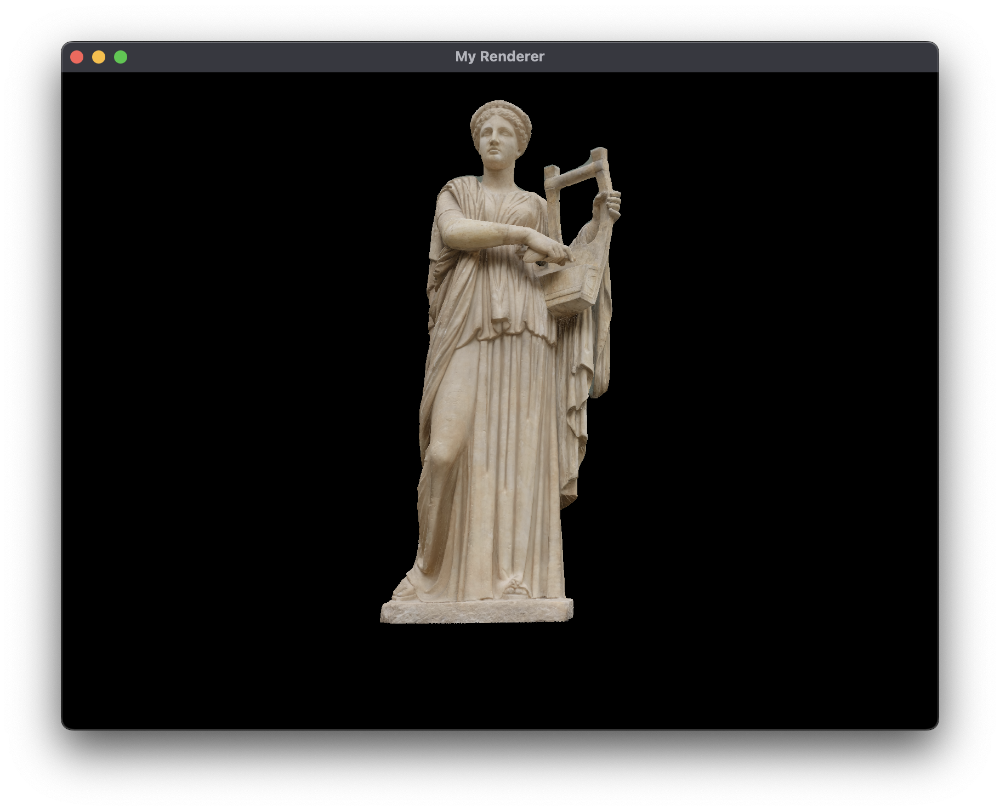

# TODOs

- [x] Setup Vulkan
- [x] Implement Drawing
- [x] Implement Vertex Buffer and Index Buffer
- [x] Implement Texturing
- [x] Implement Depth Testing
- [x] Implement Model Loading
- [ ] Implement Scene Graph
- [ ] Implement Shadow Mapping
